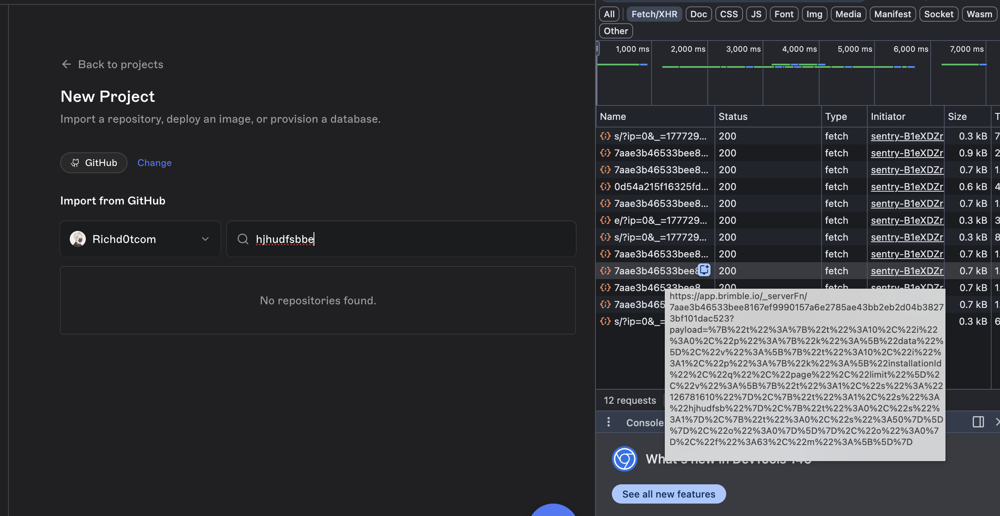
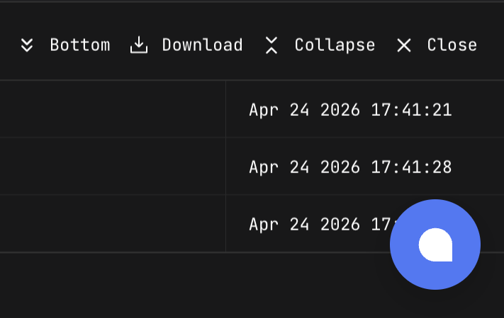
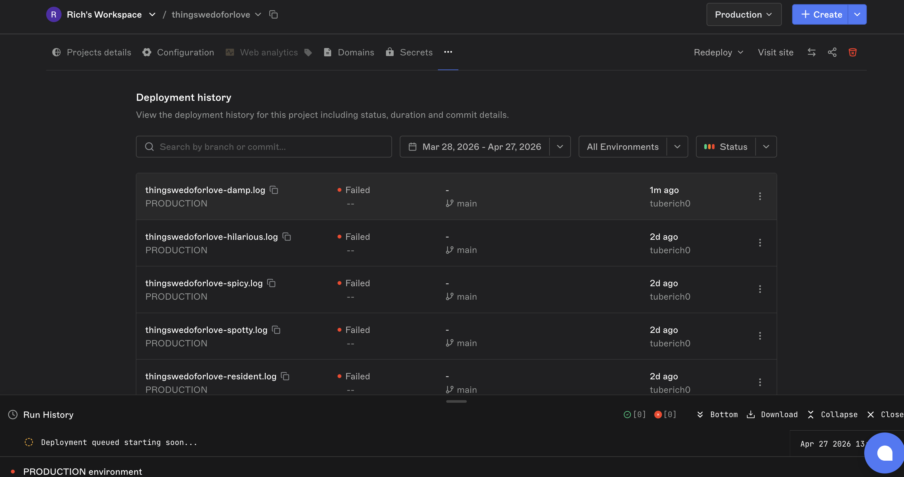
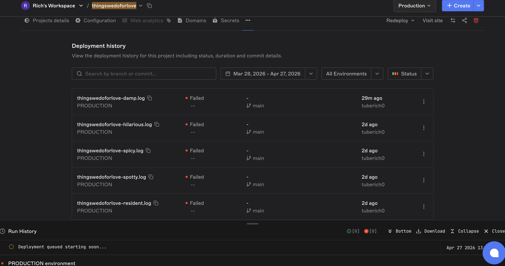
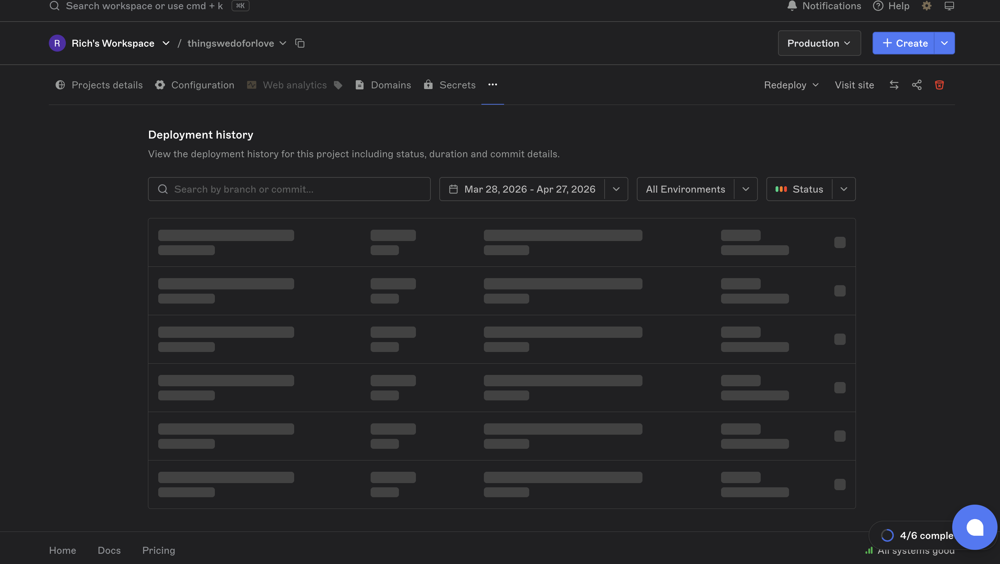

## Brimble deploy + feedback

**Deployed:** 

TLDR: Easy UI although could use some improvements, I tried deployning two apps but only one was successful.

Lets dive in:

1. Signup & onboarding: The flow was genuinely smooth 

Firstly, the UI is easy to use and navigate. However, it could use some improvements in terms of user experience. For example..

2. Repository search performance
During the "New Project" flow, the repo search appears to send a network request on every keystroke



Recommendation:  (longer) debounce on the input, I assume you prefer to prefetch the user's repo list on dashboard.

3. Annoying Chat widget
Don't get me wrong, I have nothing against chat widgets, but this one is intrusive. It blocks content (some parts of the login page).



My recommendation would be to make it movable and/or have an option to remove it completely from the current screen

4. My first (thingswedoforlove) deploy failed and I can't even see why.

The runtime was detected correctly, but the deploy failed. I couldn't see any error message or logs to help me debug the issue. It just jumped to failed.
The logs are showing

```
[Apr 27 2026  13:37:57] Deployment queued starting soon...
```
But it never actually starts. The deploy list shows failed but the dashboard show pending (una app dey whyne me) .



David emailed me to talk about it (I'm sorry I didn't get back to him) but I had to be sure it wasn't me. Plus I figured I could talk about it with him if we ever get to chat concerning this interview 🙂

P.s the same app had been deployed on vercel (with the same code) and similar settings and it still works [here]("https://thingswedoforlove.vercel.app/")

5. second app deployed (even though It was just a static site)
[here]("https://advice-generator-app.brimble.app/")


Other UI quirks
- cant switch project until I close log console
  
- Deployment history takes 1 eternity to display unless I refresh
  
